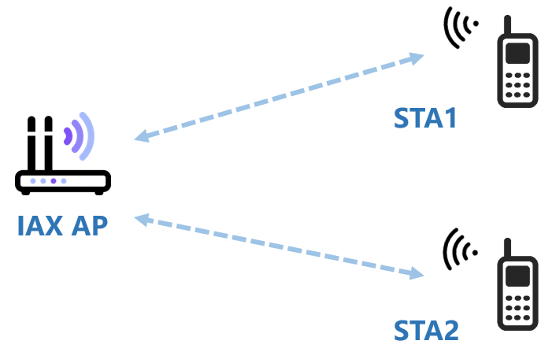
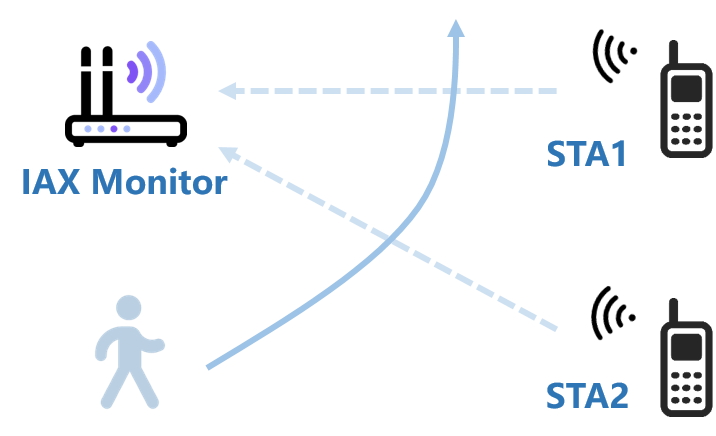

# IAX 

**Other Languages: [English](README.md), [中文](README_zh.md).**

IAX CSI Tool supports:
* Intel AX200/201/210/211, Intel 5300
* IEEE 802.11a/g/n/ac/ax, Non-HT/HT/VHT/HE
* STA, AP, Monitor, Injector modes
* 20/40/80/160MHz

# Installation
## Prerequisites
1. The current CSI feature for Intel AX NIC is based on the Linux 5.15.x kernel (API specification). Ubuntu 20.04/22.04 systems that have been tested with kernel matching, such as 22.04.5 default kernel 6.8 do not match. Some distributions have to select the 5.15.x kernel in the `Advanced Options for Ubuntu` startup item. Ubuntu 22.04.0/1 is recommended.
2. For the ported Intel 5300 CSI Tool functionality, it's based on the Linux 5.15.69 kernel iwldvm driver.
3. Ensure a stable internet connection during installation.

## Installation Commands
The installation process involves dependency installation, driver compilation updates, and firmware updates, which can be time-consuming.
```shell
$ cd iwlwifi
$ sudo ./setup.sh
```

# Usage
It mainly includes the following steps:
1. Configuration - Configure network card mode and CSI parameters.
2. CSI Listening - Retrieve CSI data from the driver (C++/Python).
3. CSI Parsing - Parse CSI header information and matrix data (Matlab/Python).

## Configuration
Configuration mainly consists of two steps:
1. Configure network card into STA/AP/Monitor/Injector mode, such as connecting to AP in STA mode, setting the listening channel and bandwidth in Monitor mode.
2. Set CSI parameters and enable CSI functionality, such as MAC filtering, interval time, packet injection type, etc.

### STA Mode
In STA mode, IAX associates with an AP, and CSI is measured based on downlink data packets without any modification on the AP side, as shown in the figure below.
The type of CSI data depends on the type of received data packets. For example, when connected to an IEEE 802.11ac VHT 80MHz AP, we can obtain VHT 80MHz CSI from data packets, and Non-HT 20MHz CSI from control packets.

<!--

-->
<div align="center">

</div>

As shown below, IAX connects `wlp8s0` network card to WiFi and activates CSI functionality.
```shell
$ cd tools
$ sudo ./connect-wifi.sh wlp8s0 wifi wifi-passwd # or manually connect to WiFi
$ sudo ./iaxcsi-activate.sh
```

### AP Mode
When IAX is in AP mode, it can provide communication services to associated clients and obtain CSI data from uplink data packets, as shown in the figure below.
No modification is required on the client side, and the type of obtained CSI data is similar to that in STA mode.

<div align="center">

</div>

As shown below, IAX establishes an AP hotspot on `wlp8s0` network card and activates CSI functionality.
Install [create_ap](https://github.com/oblique/create_ap) if not already installed.
```shell
$ cd tools
$ sudo create_ap --ieee80211n -c 2 wlp8s0 eth0 wifi wifi-passpd # or other methods to set up AP
$ sudo ./iaxcsi-activate.sh
```

### Monitor Mode
In AP mode, IAX can only obtain CSI data from connected clients. In contrast, in Monitor mode, IAX can obtain CSI by monitoring wireless traffic in the surrounding environment, as shown in the figure below.
Monitor mode here is similar to promiscuous mode in Ethernet but requires being on the same channel in wireless communication.

<div align="center">

</div>

As shown below, IAX monitors channel 40 with 160MHz bandwidth on `wlp8s0` network card.
```shell
$ cd tools
$ sudo ./iaxcsi-set-monitor.sh wlp8s0 40 HE160
```

### Injector Mode
Injector mode is a type of Monitor mode but differs from Monitor mode in that it allows writing data to the channel.
By injecting data packets with custom protocols and bandwidth attributes in Injector mode, wireless network performance can be tested and evaluated.

Configuration is similar to Monitor mode but requires additional packet injection operations, as shown below.
```shell
$ cd injection
$ sudo ./setup.sh # run only once
$ sudo ./inject.sh interface packet_count interval_microseconds # default for 5300 MAC, modify the script as needed
$ # sudo ./inject.sh wlp8s0mon0 100 1000
```
Since the injection end does not obtain CSI, no additional steps are required. The receiving end needs to use Monitor mode for data reception.

## CSI Listening
Upon completing the configuration, when the userspace process receives packets that meet the specified conditions, CSI data will be obtained from the driver.

### C++
You can specify the network interface to listen on and the file path to save the CSI data. Networking functionality is optional, as demonstrated below. The commented example listens to CSI on `wlp8s0mon0`, saves it to a local file, and sends it to a specified TCP server.

```shell
$ cd csi/iaxcsi/cpp
$ sudo ./setup.sh # Only run this the first time
$ sudo ./iaxcsi 网卡 保存文件 [TCP服务器地址，如127.0.0.1:12345]
$ # sudo ./iaxcsi wlp8s0mon0 /tmp/iax.csi 127.0.0.1:12345
```

### Python
TODO

## CSI Parsing
Upon receiving CSI data from the driver, the following steps will parse CSI header information and matrices.

### Matlab
1. Read CSI from a file:
    ```matlab
    > envs % add dependency paths
    > iaxcsi("iax.csi").read()
    ```
2. Start a TCP server to receive CSI in real-time:
    ```matlab
    > envs
    > h = iaxcsi("tcp-server:0.0.0.0:12345");
    > st = h.read_next();
    > st = h.read_next();
    ```
    ```matlab
    > envs
    > h = iaxcsi("tcp-server:0.0.0.0:12345");
    > h.set("read_count", 100);
    > sts = h.read();
    ```
`iaxcsi(args)` accepts the following `args`:
1. CSI file path, e.g., `./iax.csi`.
2. Network address, e.g., `tcp-server:0.0.0.0:12345`, indicates listening as a TCP server to receive CSI data. Similarly, there are "tcp-client", "udp-server", "udp-client".

The object returned by `h=iaxcsi(args)` provides operations:
1. `read_st(buf)`: returns CSI data based on `buf`.
2. `read_next()`: returns CSI data sequentially.
3. `read()`: returns all CSI data.
4. `set("key", val [, "key2", val2])`: sets parameters, such as setting read count and timeout before `read` for network address.

### Python
TODO

## Complete Examples
### Monitoring VHT80 CSI on Channel 40
```shell
$ sudo ./tools/iaxcsi-set-monitor.sh wlp8s0 40 VHT80
$ sudo ./csi/iaxcsi/cpp/iaxcsi wlp8s0mon0 /tmp/iax.csi
```
```matlab
> envs
> sts = iaxcsi("/tmp/iax.csi").read();
```
### Real-time Monitoring VHT80 CSI on Channel 40
```matlab
> envs
> h = iaxcsi("tcp-server:0.0.0.0:12345").set("read_count", 100);
> sts = h.read();
```
```shell
$ sudo ./tools/iaxcsi-set-monitor.sh wlp8s0 40 VHT80
$ sudo ./csi/iaxcsi/cpp/iaxcsi wlp8s0mon0 /tmp/iax.csi 127.0.0.1:12345
```
## Restore
To restore original firmware and driver.
```shell
$ cd iwlwifi
$ sudo ./restore.sh
```

# Miscellaneous
## Script Explanation
### Intel AX CSI Parameter Configuration
```shell
$ cd tools
$ sudo ./iaxcsi-activate.sh [CHN_TYPE] [INTERVAL_US] [MACS]
$ # sudo ./iaxcsi-activate.sh VHT40- 1000 00:16:ea:12:34:56 00:16:ea:12:34:57
```
`CHN_TYPE` is the channel type, e.g., VHT40-, HE160, etc. `INTERVAL_US` is the interval time in microseconds. `MACS` are MAC addresses for filtering. Some less frequently modified parameters can be adjusted in the script, such as antenna selection in Injector mode.

The example shows listening with MAC addresses "00:16:ea:12:34:56" or "00:16:ea:12:34:57", on a 40MHz channel width with an interval of 1000us to obtain CSI data. For Injector mode, it specifies the injected packet type as VHT.

### Intel AX Monitoring Setup
```shell
$ cd tools
$ sudo ./iaxcsi-set-monitor.sh WLAN CHN CHN_TYPE [INTERVAL_US] [MACS]
$ # sudo ./iaxcsi-set-monitor.sh wlp8s0 40 HE160
```
`WLAN` is the network interface, e.g., `wlp8s0`. `CHN` is the channel number. Similar to `iaxcsi-activate.sh`, with additional parameters. Some less frequently modified parameters can be adjusted in the script, such as the number of received CSIs.
The monitored network interface name generated from `wlp8s0` is like `wlp8s0mon0`.

For 5300 using `00:16:ea:12:34:56` MAC address, use `iaxcsi-set-injector.sh` instead of `iaxcsi-set-monitor.sh`.

## Other Notes
* Intel AX210/211 supports 6G CSI.
* The firmware for Intel AX201 is not yet included, and it is not clear to use the firmware that comes with the system. (No equipment yet)
* Antenna selection for injected packets can be modified in `iaxcsi-activate.sh`.
* `incsi` corresponds to Intel 5300 CSI functionality and is used similarly.

# FAQ
## Reset
Many issues can be resolved by reseting.
```shell
$ cd iwlwifi
$ sudo ./setup.sh
```
## Failure check
You can check the `dmesg` check when activation fails, for possible reasons: 
1. The kernel version does not correspond (not 5.15.x), which can be checked by `uname -r`.
2. The installation process failed.

## Data reception error
In the operation of the cpp program, -28, -31 or other errors are returned, which may be caused by:
1. Not running with sudo.
2. Stored target file permission issues.

# Powered By
## Intelligent Perception Lab
<a href="https://ustc-ip-lab.github.io/"></a>
